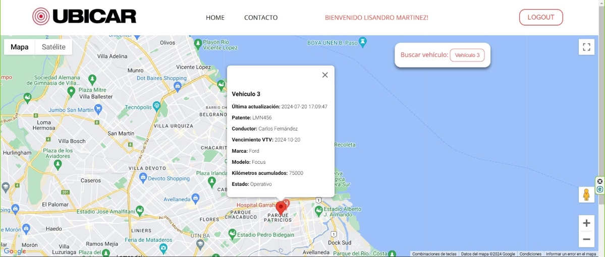

<p align="center">
  
</p>

<div align="center">

   
   
   
   <br>

   
   
   
   
   
   
</div>

<h1 align="center">Localización de Vehículos</h1>

Este proyecto consiste en una aplicación para la localización de vehículos. La aplicación permite a los usuarios ver la ubicación de los vehículos en un mapa en tiempo real y realizar diversas acciones relacionadas con la gestión de vehículos.

<p align="center">
  
  
</p>

## Tabla de Contenidos

- [Descripción del Proyecto](#descripción-del-proyecto)
- [Características](#características)
- [Tecnologías Utilizadas](#tecnologías-utilizadas)
- [Configuración del Entorno](#configuración-del-entorno)
- [Uso](#uso)
- [Documentación de MySQL](#documentación-de-mysql)
- [Código PHP](#código-php)
- [Manejo de Errores en JavaScript](#manejo-de-errores-en-javascript)
- [Experiencia UX/UI](#experiencia-uxui)
- [Autor](#autor)
<br>

## Descripción del Proyecto

Este proyecto se desarrolló de acuerdo con la siguiente consigna recibida:

> Ubinet S.A., es una empresa que se dedica al seguimiento vehicular y logística de flotas mediante geoposicionamiento. La empresa está enfocada en la generación de herramientas y productos tecnológicos de telemetría para la mejora continua de los procesos administrativos, operativos y logísticos de sus clientes. La plataforma web de administración de flotas vehiculares permite optimizar los recursos de la operación logística, reducir costos de combustible, minimizar riesgos de accidentes, proteger los activos y mejorar la administración del personal a cargo y vehículos propiedad de la empresa en su totalidad. <br>La consigna pedía: Realizar la interfaz de usuario para una aplicación que permita visualizar una flota de vehículos y visualizar en el mapa la posición del mismo. Su página web es https://ubicar.com.ar/

La implementación se ha centrado en utilizar tecnologías modernas y herramientas específicas para cumplir con estos requisitos de manera efectiva.

## Características
- Visualización en tiempo real de la ubicación de los vehículos en un mapa.
- Filtro de vehículos por ID.
- Interacción con los marcadores en el mapa para obtener información detallada.
- Diseño responsivo para adaptarse a diferentes tamaños de pantalla.

## Tecnologías Utilizadas
- **Frontend**: HTML, CSS, JavaScript
- **Mapas**: Google Maps API
- **Backend**: PHP
- **IDE**: Visual Studio Code

## Configuración del Entorno

1. Clona el repositorio:
   ```bash
   git clone https://github.com/Fica-Millan/irso_DIP-PracticaProfesionalizante_2024.git
   ```
2. Navega al directorio del proyecto:
   ```bash
   cd <nombre-del-directorio>
   ```
3. Abre el proyecto en tu editor de código.

4. Configura las conexiones a la base de datos y otros parámetros en el archivo de configuración:

- Asegúrate de tener `XAMPP` instalado y en ejecución.
- Configura la base de datos MySQL en `config.php` con los detalles correctos (puerto, usuario, contraseña, nombre de la base de datos).
- Crea un archivo .env en el directorio raíz del proyecto y agrega tu API KEY:

 ```env
API_KEY=tu_api_key_aqui
 ```
6. Abre `index.php` en tu navegador para ver la aplicación en acción. Asegúrate de que `XAMPP` esté ejecutándose y que el servidor `Apache` y `MySQL` estén iniciados.


## Uso

- **Abrir la Aplicación**: Abre tu navegador y navega a la siguiente dirección:
```arduino
http://localhost/Ubinet/
```
- **Visualizar Vehículos**: La aplicación cargará un mapa interactivo con los vehículos marcados.
- **Filtrar Vehículos**: Usa el menú de filtro para buscar vehículos por ID.
- **Interacción**: Haz clic en los marcadores para ver detalles sobre cada vehículo.

## Documentación de MySQL

A continuación se presenta el script SQL para crear y poblar la base de datos `ubinet`. Asegúrate de ejecutar este script en tu servidor MySQL para preparar la base de datos antes de usar la aplicación.

```sql
-- Crear la base de datos
CREATE DATABASE ubinet;

-- Seleccionar la base de datos
USE ubinet;

-- Crear la tabla vehiculos
CREATE TABLE vehiculos (
    id INT AUTO_INCREMENT PRIMARY KEY,
    nombre VARCHAR(255) NOT NULL,
    latitud DOUBLE NOT NULL,
    longitud DOUBLE NOT NULL,
    ultima_actualizacion TIMESTAMP DEFAULT CURRENT_TIMESTAMP ON UPDATE CURRENT_TIMESTAMP,
    patente VARCHAR(20) NOT NULL,
    conductor VARCHAR(255) NOT NULL,
    vencimiento_vtv DATE NOT NULL,
    marca VARCHAR(50) NOT NULL,
    modelo VARCHAR(50) NOT NULL,
    kilometros_acumulados INT NOT NULL,
    estado VARCHAR(50) NOT NULL
);

-- Insertar datos de ejemplo en la tabla vehiculos
INSERT INTO vehiculos (nombre, latitud, longitud, ultima_actualizacion, patente, conductor, vencimiento_vtv, marca, modelo, kilometros_acumulados, estado) VALUES
('Vehículo 1', -34.603722, -58.381592, NOW(), 'ABC123', 'Juan Pérez', '2024-12-31', 'Toyota', 'Corolla', 50000, 'Operativo'),
('Vehículo 2', -34.615803, -58.433298, NOW(), 'XYZ789', 'Ana Gómez', '2024-11-15', 'Honda', 'Civic', 30000, 'Mantenimiento'),
('Vehículo 3', -34.634913, -58.397677, NOW(), 'LMN456', 'Carlos Fernández', '2024-10-20', 'Ford', 'Focus', 75000, 'Operativo');
```

### Creación de la Tabla `usuarios` y Ejemplo de Datos
Para que el sistema de autenticación funcione correctamente, es necesario configurar una tabla en la base de datos para almacenar la información de los usuarios. A continuación, se explica cómo crear la tabla usuarios y cómo insertar un usuario de ejemplo con una contraseña encriptada.

1. Crear la Tabla usuarios
Ejecuta la siguiente consulta SQL para crear la tabla usuarios en tu base de datos:

```sql
CREATE TABLE usuarios (
    id INT AUTO_INCREMENT PRIMARY KEY,
    nombre VARCHAR(100) NOT NULL,
    email VARCHAR(100) NOT NULL UNIQUE,
    password VARCHAR(255) NOT NULL,
    creado_en TIMESTAMP DEFAULT CURRENT_TIMESTAMP
);
```

2. Insertar Datos de Ejemplo

Para probar el sistema, hay que insertar un usuario de ejemplo. La contraseña debe estar encriptada, ya que asegura que las contraseñas de los usuarios estén protegidas, incluso si alguien accede a la base de datos. Utilizando `bcrypt`, un algoritmo de encriptación robusto que añade un "salt" (valor aleatorio) a la contraseña antes de encriptarla, proporcionando una mayor seguridad, para asegurar que no se almacene en texto plano.
Sigue estos pasos:

Generar la Contraseña Encriptada:

Utiliza una herramienta de encriptación bcrypt, como https://bcrypt-generator.com/, para generar una versión encriptada de la contraseña. Por ejemplo, la contraseña 123456 puede encriptarse en:

```perl
$2a$12$AKjH3oWM7f9GhjioNIW/6ekn5BzZW7q/jm9MmiY/OKIEp4OvQ069S
```

Insertar el Usuario en la Base de Datos:

Ejecuta la siguiente consulta SQL para insertar el usuario de ejemplo en la tabla usuarios:

```sql
INSERT INTO usuarios (nombre, email, password, creado_en)
VALUES ('Juan Perez', 'j.perez@gmail.com', '$2a$12$AKjH3oWM7f9GhjioNIW/6ekn5BzZW7q/jm9MmiY/OKIEp4OvQ069S', CURRENT_TIMESTAMP);
```

## Código PHP
El archivo `get_vehiculos.php` es un script PHP que se encarga de obtener la información de los vehículos desde la base de datos y devolverla en formato JSON. Esto permite que el frontend de la aplicación pueda solicitar y visualizar los datos de los vehículos en el mapa. A continuación, se presenta una explicación detallada del código:

```php
<?php
header('Content-Type: application/json');

// Conectar a la base de datos
$conn = new mysqli('localhost:3307', 'root', '', 'ubinet');

// Verificar conexión
if ($conn->connect_error) {
    die("Conexión fallida: " . $conn->connect_error);
}

// Consulta para obtener los vehículos
$sql = "SELECT * FROM vehiculos";
$result = $conn->query($sql);

$vehiculos = array();
while($row = $result->fetch_assoc()) {
    $vehiculos[] = $row;
}

// Devolver datos en formato JSON
echo json_encode($vehiculos);

// Cerrar conexión
$conn->close();
?>
```

## Manejo de Errores en JavaScript

En esta sección se presenta el código JavaScript que maneja la inicialización del mapa y la carga de datos de vehículos desde el servidor. También incluye el manejo de errores para asegurar una buena experiencia de usuario.

Descripción del Código:

- Inicialización del Mapa: Se crea un nuevo objeto google.maps.Map centrado en una ubicación predeterminada. Se verifica que la API de Google Maps esté disponible antes de proceder.
- Carga de Datos: Se realiza una solicitud fetch al endpoint get_vehiculos.php para obtener los datos de los vehículos. Si la solicitud es exitosa, se actualizan los marcadores en el mapa.
- Manejo de Errores: Se manejan posibles errores en la solicitud de red y en la inicialización del mapa utilizando try...catch y Swal.fire para mostrar notificaciones al usuario.
- Interacción del Usuario: Se notifican los errores y las advertencias al usuario de manera clara para mejorar la experiencia de uso.

```javascript
// Función de inicialización del mapa
function initMap() {
    // Verificar que google está definido
    if (typeof google === 'undefined' || !google.maps) {
        console.error('Google Maps API no está disponible');
        return;
    }

    try {
        // Crear el mapa
        map = new google.maps.Map(document.getElementById('map'), {
            center: { lat: -34.6037, lng: -58.3816 },
            zoom: 13
        });

        // Cargar los vehículos desde el servidor
        fetch('php/get_vehiculos.php')
        .then(response => {
            if (!response.ok) {
                throw new Error('Error en la respuesta de la red');
            }
            return response.json();
        })
        .then(data => {
            if (Array.isArray(data) && data.length > 0) {
                vehiculos = data;
                populateVehiculoSelect();
                updateMarkers('all'); // Mostrar todos los vehículos inicialmente
            } else {
                Swal.fire({
                    icon: 'warning',
                    title: 'Aviso',
                    text: 'No hay datos de vehículos disponibles.',
                    confirmButtonText: 'Aceptar'
                });
            }
        })
        .catch(error => {
            Swal.fire({
                icon: 'error',
                title: 'Error',
                text: 'No se pudo cargar la información de los vehículos.',
                confirmButtonText: 'Aceptar'
            });
        });

        // Manejar el cambio en la selección de vehículos
         document.getElementById('vehiculoSelect').addEventListener('change', function() {
            updateMarkers(this.value);
        });
    } catch (error) {
        Swal.fire({
            icon: 'error',
            title: 'Error',
            text: 'Error al inicializar el mapa.',
            confirmButtonText: 'Aceptar'
        });
    }
}
```


## Experiencia UX/UI

Para mejorar el diseño de la página desde una perspectiva UX/UI se considero:

#### 1. Diseño y Estructura:
- Consistencia: Todos los elementos son consistentes a lo largo de la página, para mantener la coherencia.
- Espaciado: Se usan márgenes y rellenos adecuados para que el contenido no se sienta abarrotado, mejorando la legibilidad, haciendo que la página se vea más organizada.
- Jerarquía Visual: Se destacan los elementos más importantes con tamaños de fuente más grandes y colores llamativos, de esta manera se ayuda a guiar al usuario a través del contenido.
#### 2. Navegación y Usabilidad:
- Accesibilidad: La aplicación es accesible para todos los usuarios, incluyendo aquellos con discapacidades. Se usa el contraste adecuado y etiquetas para elementos interactivos.
- Responsividad: Se utilizan técnicas de diseño responsivo y media queries.

<p align="center">
  
  
</p>


<p align="center">
  
  
</p>

- Facilidad de Uso: Los usuarios pueden encontrar fácilmente la funcionalidad que necesitan, a traves de un menú claro y opciones de búsqueda que facilitan la navegación.
#### 3. Interacción y Feedback:
- Feedback de Usuario: Se proporciona retroalimentación visual cuando los usuarios interactúan con elementos de la página (por ejemplo, cambios en los colores de los elementos y mensajes de errores).

<p align="center">
  
  
  
</p>

#### 4. Diseño del Mapa:
- Claridad de los Marcadores: Los marcadores son visibles y claramente diferenciados. 
- Filtrado y Búsqueda: Se ofrece opciones de filtrado y búsqueda para que los usuarios puedan encontrar vehículos específicos rápidamente.
#### 5. Estilo Visual:
- Paleta de Colores: Se utiliza una paleta de colores coherente que refleje la identidad de la empresa y es agradable a la vista. 
- Tipografía: Se usa fuentes legibles y el tamaño del texto es el adecuado para la lectura. 

## Autor
Este proyecto fue creado por [Fica](https://github.com/Fica-Millan).

¡Siéntete libre de contactarme si tienes alguna pregunta o sugerencia!

[LinkedIn](https://www.linkedin.com/in/yesica-fica-millan/)

